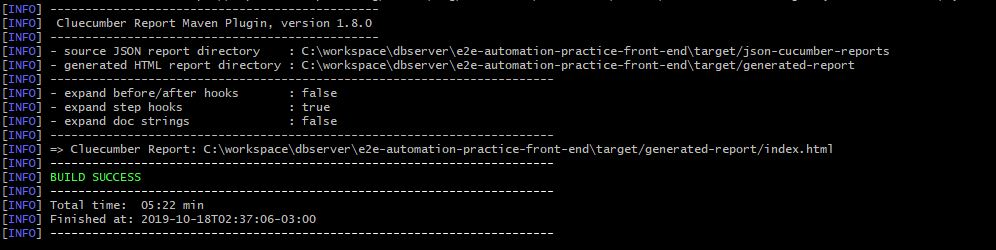

# AUTOMATION PRACTICE

Projeto desenvolvido como uma avaliação.

## TESTE

*   Compra
    * [CT001 - AP - Realizar uma compra com sucesso](feature/Compra.feature)

## PRÉ-REQUISITOS

Requisitos de software e hardware necessários para executar este projeto de automação

*   Java 1.8 SDK
*   Maven 3.5.*

## EXECUTANDO OS TESTES

```
mvn verify
```

## EVIDENCIA

O arquivo com as evidencia ficam na pasta target do projeto, esta pasta só é criada depois da primeira execução.

```
 Arquivo: [caminho da sua maquina]e2e-automation-practice-front-end\target\generated-report/index.html
 Json Cucumber: [caminho da sua maquina]e2e-automation-practice-front-end\target\json-cucumber-reports\cukejson.json
 Xml TestNG: [caminho da sua maquina]e2e-automation-practice-front-end\target\testng-cucumber-reports\cuketestng.xml
```

## LOG NO CONSOLE

Veja o resultado do teste no console, com as informações e localização dos arquivos mencionados acima.

<div align="center">
    
</div>

## VIDEO

[](https://youtu.be/LcBMJyLSWbo)

## AUTORES

* **Rubens Lobo**