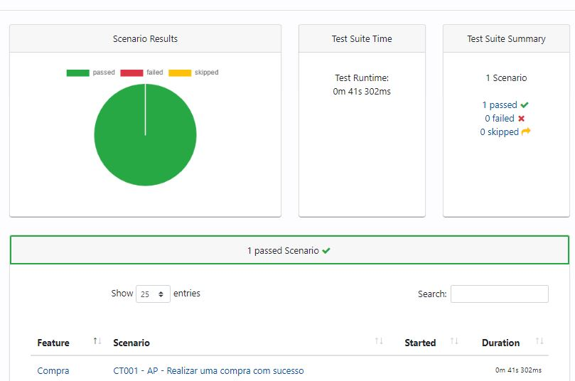
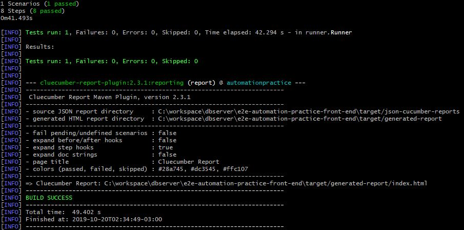

# SISTEMA - AUTOMATION PRACTICE

Projeto desenvolvido com proposito de uma avaliação.

## TESTE

*   Compra
    * [CT001 - AP - Realizar uma compra com sucesso](feature/Compra.feature)

## PRÉ-REQUISITOS

Requisitos de software e hardware necessários para executar este projeto de automação

*   Java 1.8 SDK
*   Maven 3.5.*
*   Chrome qualquer versão

## CLONE O PROJETO PARA SUA MÁQUINA LOCAL

Abra o git bash, entre no diretório escolhido na sua máquina e faça o download do projeto com o comando abaixo.

```
git clone https://github.com/rubens1287/e2e-automation-practice-front-end.git
```


## COMANDO PARA EXECUTAR OS TESTES

Com o git bash acesse a pasta do projeto, onde esta localizado o arquivo pom.xml, execute o comando abaixo para rodar os testes automatizados.

```
mvn verify
```

## EVIDÊNCIAS

Os arquivos com as evidências ficam localizados na pasta target do projeto, esta pasta só é criada depois da primeira execução.

```
 Report HTML: [caminho da sua maquina]e2e-automation-practice-front-end\target\generated-report/index.html
 Json Cucumber: [caminho da sua maquina]e2e-automation-practice-front-end\target\json-cucumber-reports\cukejson.json
 Xml TestNG: [caminho da sua maquina]e2e-automation-practice-front-end\target\testng-cucumber-reports\cuketestng.xml
```
<div align="center">
    
</div>

## LOG NO CONSOLE

Veja os resultados do testes no console com status e também a localização dos arquivos mencionados acima.

<div align="center">
    
</div>

## VIDEO

[](https://youtu.be/LcBMJyLSWbo)

## AUTOR

* **Rubens Lobo**